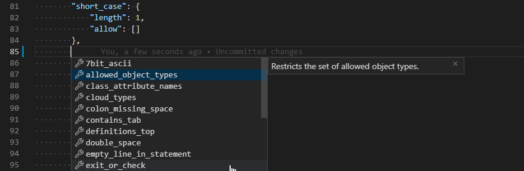

# abaplint-clean-code

Abaplint rule overview and definitions according to ABAP clean code guidelines and best practices.

[clean config](./configs/clean/abaplint.json) - rules are picked in an attempt to match the Clean ABAP styleguide.

[full config](./configs/full/abaplint.json) - example of config with every rule included

Rule documentation can be found on https://rules.abaplint.org/.

You can also find about the list of rules interactively by editing your `abaplint.json` using vscode. The [abaplint](https://marketplace.visualstudio.com/items?itemName=larshp.vscode-abaplint) plugin provides validation and autocompletion according to the [schema](https://schema.abaplint.org/schema.json) which is generated automatically from docstrings in the code.

## about abaplint

abaplint is an open source reimplementation of the ABAP parser written in Typescript. It works without a SAP system and is meant to be used on code serialized using abapGit. It is meant to be used in addition to, not instead of other checks such as ATC. 

Make sure to visit https://github.com/abaplint/abaplint for more information about how to get it running and https://abaplint.org/ for some cool stuff like statistics of open source ABAP projects, an interactive abaplint playground or diagrams of ABAP syntax.